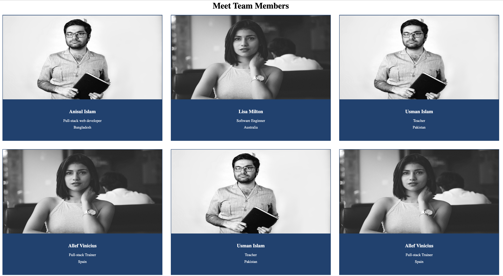
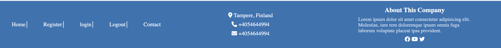

# ISA-HTML-CSS-PreAssignment

## Follow the steps carefully

### step 1: design the navigation section according to the given demo

### step 2: design the team-members section according to the given demo

### step 3: design the footer section according to the given demo

### step 4: make sure your web page is responsive (fits on any device)
